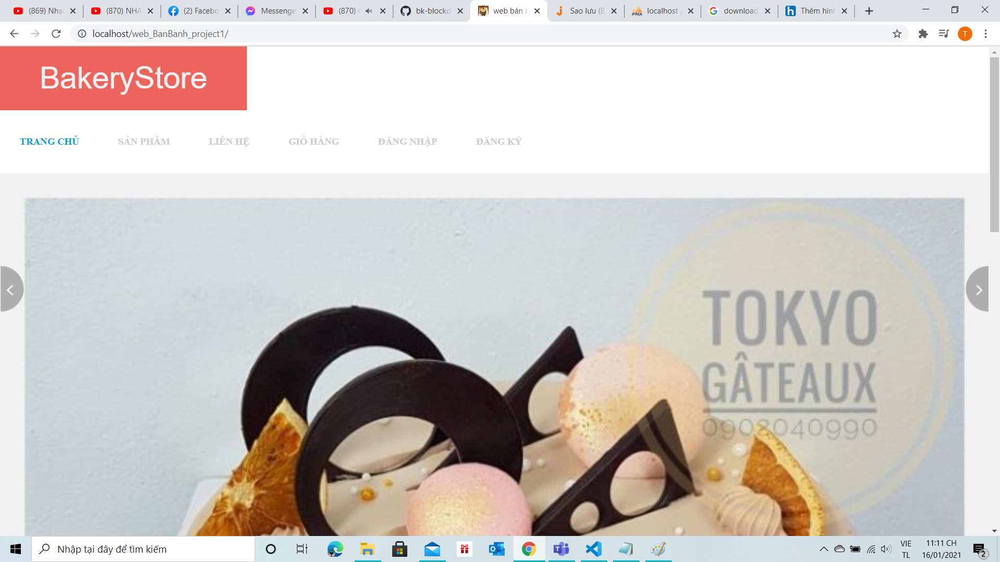

--- Web bán bánh (bakery store)---

_______________Mục Tiêu______________________

- tạo hoàn chỉnh trang web bán hàng đơn giản đầy đủ chức năng.
- thành thạo công nghệ.

_______________Công nghệ sử dụng___________________
front end: html, css, js, bootctrap.
back end: php.
tạo server: xampp.
database: php mysql.

_______________Hướng dẫn cài đặt_________________________

- cài xampp.
- cài php >= 5.6.
- cài file dữ liệu.

_______________Hướng dẫn sử dụng_______________________

- chạy trên trình duyệt: localhost/[đường dẫn chứa file]

- vào trang chủ:

- vào trang sản phẩm

_______________Demo vide__________________________

https://drive.google.com/file/d/1S0FKgS4jcruF947iXDYx6PYRScCGqdLB/view?usp=sharing

-- giới thiệu:
    - trang web bán hàng, dùng cho cửa hàng vừa và nhỏ, web có phần slide giới thiệu sản phẩm mới, phần menu, sau đó là phần content hiểu thị sản phẩm.
    - trang web gồm trang chủ, sản phẩm, liên hệ, giỏ hàng, đăng nhập, đăng ký.
    - với trang chủ sẽ hiện thị các sản phẩm mới nhất.
    - sản phẩm hiển thị sản phẩm theo yêu cầu của khác hàng như theo hương vị, theo khuyến mãi, hay theo danh mục sản phẩm.
    - liên hệ sẽ thấy địa chỉ của hàng trên google map, và địa chỉ, cách thức liên lạc.
    - giỏ hàng có các sản phẩm được mua, xóa sản phẩm trong giỏ hàng, đặt hàng,...
    - đăng xuất, đăng ký, cho khách hàng tạo tài khoản.

-- với code:
    trang web được code bằng ngôn ngữ php và theo mô hình mvc.
    gồm 3 phần chính là view, controller, model.
    - các file ko thuộc folder trên sẽ chỉ controller nào được chọn.
    - phần controller sẽ sử lý nghiệp vụ, lưu xóa session, nhận model và gọi tới view tương ứng.
    - phần model connect DB, query DB.
    - phần view hiển thị nội dung trang web ra màn hình.

-- sâu vào code:
    - lớp index.php: chạy chương trình gọi tới c_trang_chu.
    - lớp san_pham.php: gọi tới c_san_pham.
    - lớp lien_he.php: gọi tới c_lien_he.
    - lớp gio_hang.php: gọi tới c_gio_hang.
    - lớp dang_nhap.php: gọi tới c_dang_nhap nếu đã đăng nhập thì thoát đăng nhập rồi hiển thị trang đăng nhập.
    - lớp dang_ky.php: gọi tới c_dang_ky.
    - lớp chitiet_sp.php: gọi tới c_chi_tiet_san_pham.
    - lớp chon_mua.php: lưu vào session và hiển thị thông báo thêm vào giỏ thành công
    - lớp thoat_dang_nhap.php: gọi tới c_dang_nhap.php
    - lớp xoa_gio_hang.php: xóa session tại id nếu muốn xóa 1 sp, và xóa tất cả session nếu muốn xóa cả giỏ hàng, và chuyển tới trang sản phẩm.
    - lớp XL_tim_san_pham.php: nhận chủ đề rồi tìm kiếm trên model sản phẩm và hiển thị luôn.
    - lớp XL_tim_theo_huong_vi.php: nhận chủ đề rồi tìm kiếm trên model sản phẩm và hiển thị luôn.
    - lớp XL_tim_theo_khuyen_mai.php: nhận chủ đề rồi tìm kiếm trên model sản phẩm và hiển thị luôn.

    <-models->
    - lớp config.php: dữ liệu connect DB.
    - lớp database.php: connect DB, và các hàm thực thi truy vấn.
    - lớp m_khach_hang.php: truy vấn khách hàng. gồm các phương thức
        + Doc_khach_hang:
        + Doc_khach_hang_theo_taikhan_matkhau:
        + Them_khach_hang:
        + Them_hoa_don:
        + ThemChiTietHoaDon:
    - lớp m_san_pham.php: truy vấn sản phẩm gồm các phương thức
        + Doc_san_pham:
        + Doc_san_pham_theo_ma_san_pham:
        + Doc_san_pham_theo_ma_khuyen_mai:
        + Doc_san_pham_theo_ngay_them:
        + Doc_chu_de:
        + Doc_san_pham_cung_chu_de:
        + Doc_khuyen_mai:
        + Doc_huong_vi:
        + Tim_san_pham_theo_chu_de:
        + Tim_san_pham_theo_khuyen_mai:
        + Tim_san_pham_theo_huong_vi:
        + lay_san_pham_cho_gio_hang:
    
    <-controllers->
    - lớp c_chi_tiet_san_pham.php: có phương thức Hien_thi_chi_tiet_san_pham: nhận ma_san_pham từ $get rồi đọc sản phẩm và hiển thị ra view chi tiết sản phẩm
    - lớp c_dang_nhap.php: có các phương thức Hien_thi_dang_nhap: nếu đăng nhập thành công hiển thị thông báo thành cồn và vào trang trang chủ ngược lại nếu đăng nhập ko thành công hiển thị thông báo đăng nhập ko hợp lệ.
    phương thức thoat_dang_nhap: xóa session chuyển sang trang đăng nhập.
    phương thức luu_dang_nhap: Đọc khách hàng có tồn tại nếu có thì ghi nhớ tài khoản mật khẩu khách hàng trong session.
    - lớp c_dang_ky.php: có phương thức them_khach_hang: kiểm tra thông tin khách hàng nếu đầy đủ sẽ lưu tài khoản khách hàng.
    - lớp c_trang_chu.php: có phương thức Hien_thi_trang_chu: lấy các sản phẩm theo khuyến mãi và theo ngày thêm và hiển thị ra view trang chủ.
    - lớp c_san_pham.php: có phương thức Hien_thi_san_pham: đọc tất cả sản phẩm, sản phẩm theo hương vị, theo chủ đề, theo khuyến mãi và hiển thị ra view sản phẩm.
    - lớp c_lien_he.php: gọi tới view liên hệ.
    - lớp c_gio_hang.php: có các phương thức:
        + xem_gio_hang:
        + layGioHang:
        + lay_thong_tin_san_pham:
        + themGioHang:
        + dat_hang:
        + xoaMatHang:
        + xoaGioHang:
        + thanh_tien:
        + so_luong:
        + tongSoMatHang:
        + capNhaoGioHang:

    - lớp Pager.php.php: chuyển trang khi nhiều sản phẩm quá ko hiển thị hết.
    <-Views->
    - v_chi_tiet_san_pham.php
    - v_dang_nhap.php
    - v_dang_ky.php
    - v_gio_hang.php
    - v_lien_he.php
    - v_mua_hang.php
    - v_san_pham.php
    - v_trang_chu.php